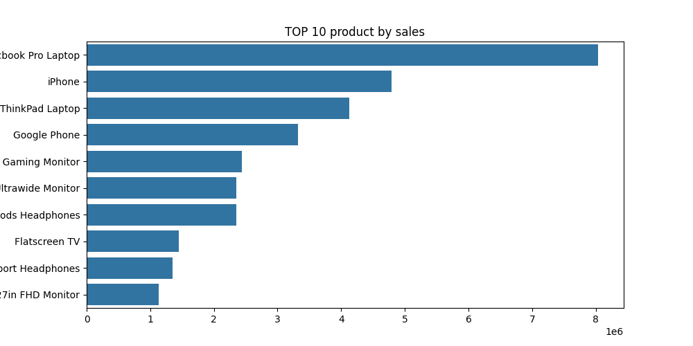

#Sales Data analysis project

##project overview
This Project analyzes sales data to identify revenue trends,top-selling products,and business insights using python.
----

##Objectives
-analyze total sales
-Find top-performing products
-Identify monthly sales trends
-Create visualizations for business insights

-----

## Tools & Libraries Used
- Python
- pandas
- Matplotlib
- Seaborn
- Jupyter Notebook

-----

## Dataset
Sales dataset containing:
- Product information
- Sales values
- Order dates
- Categories

-----

## steps perfomed
1. Imporrted Dataset
2. Cleaned and checked data
3. Perfomed exploratory data analysis
4. created visualizations
5. generated business insights

-----

##visualization

### Sales by category

### Monthly Sales Trend

###top prtoducts

-----

## Key Insights
- some product categories generated significantly higher revenue.
- Monthly sales trends showed peak sales periods
- top-perfoming products contributed major revenue share.

-----

## Conclusion
This project demonstrates basic data analysis and visualization skills using python and 
hepls understand business sales perfomance.